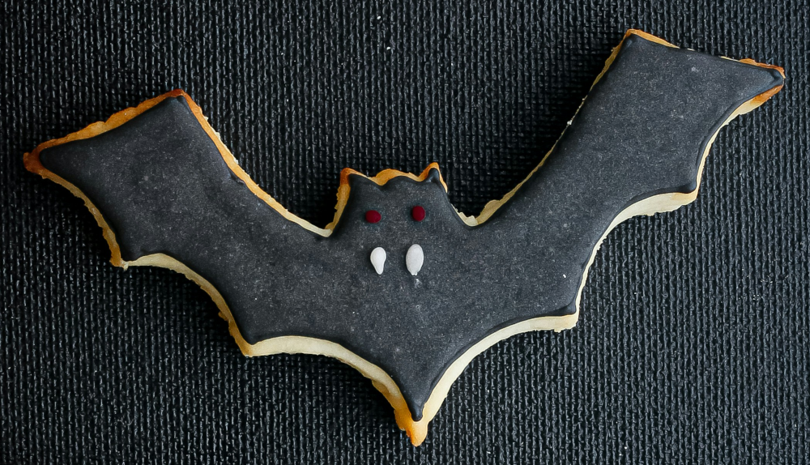

# DotTheBat

This project loads an image sourced from unsplash.com of a bat chilling out. The goal is to connect the dots to complete drawing an outline of the creature. Each click save a point in an array list that is used in the draw function to draw vertices.

Find an image to load so you can click on it such as one like https://unsplash.com/photos/a-group-of-small-objects-with-faces-n8RpJffFXZc

Photo by <a href="https://unsplash.com/@plate_stories_tsi?utm_source=unsplash&utm_medium=referral&utm_content=creditCopyText">TSI</a> on <a href="https://unsplash.com/photos/a-group-of-small-objects-with-faces-n8RpJffFXZc?utm_source=unsplash&utm_medium=referral&utm_content=creditCopyText">Unsplash</a>
      
