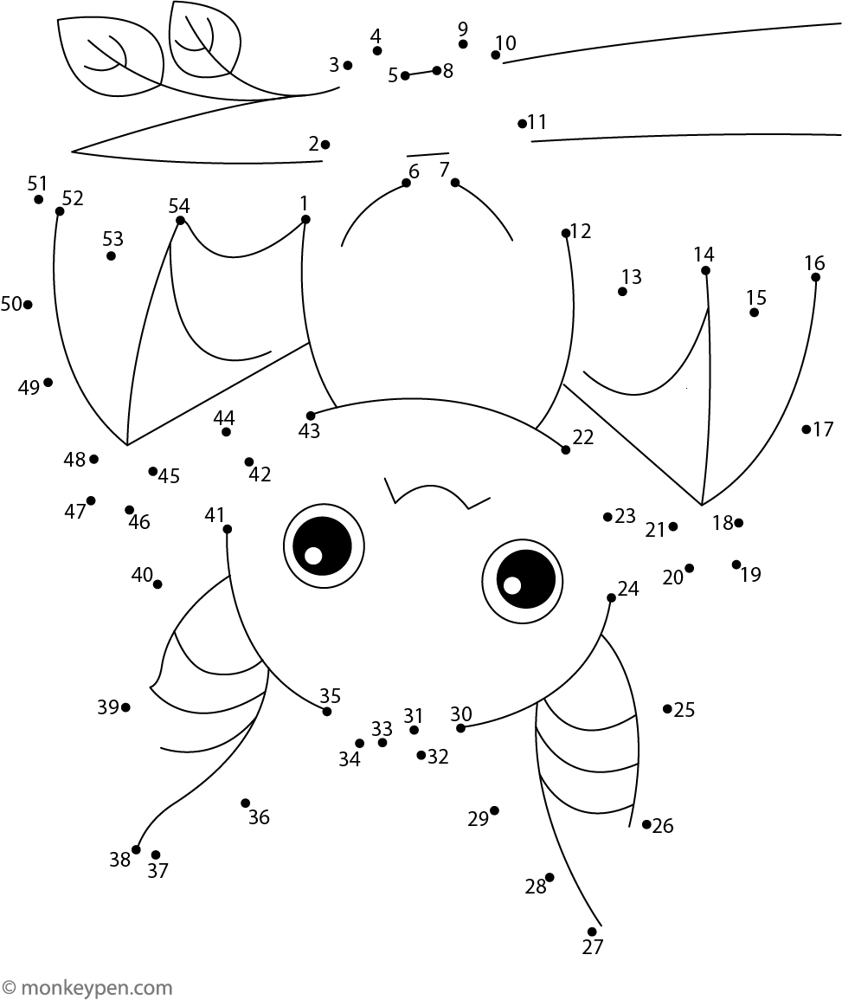

# DotTheBat

This project loads an image sourced from monkeypen.com of a bat hanging upside down. The goal is to connect the dots to complete drawing an outline of the creature. Each click save a point in an array list that is used in the draw function to draw vertices .

